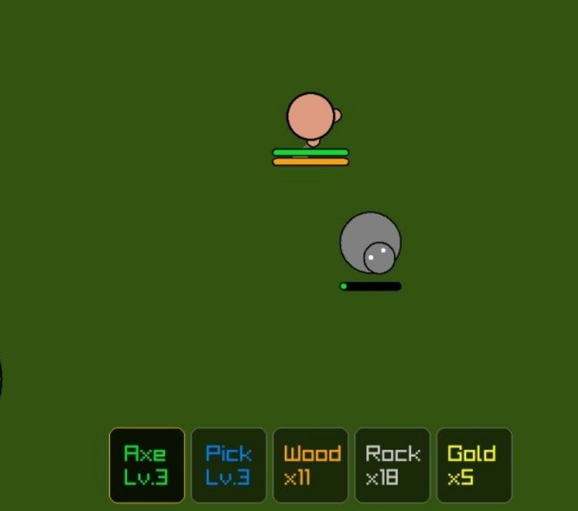

# 🌋 ASHCORE

An open-source, high-performance hardcore survival game written in pure **C++** using the **Raylib** library. Inspired by classic top-down survival mechanics (like doomed.io), built for ultra-responsive gameplay, lag-free physics, and intense PvP.

---

## 🚀 Current Status: Alpha v0.4.0

The project is evolving rapidly from a basic prototype into a deep, playable survival framework.

### 🎮 Implemented Features:
* **The Core Game Loop (New!):** Implemented a complete game loop. Players can now take damage, die, and trigger a **Death Screen** that redirects back to the Main Menu, dynamically recreating the world for a fresh run.
* **Combat & Damage Mechanics (New!):** Added dynamic damage systems. You can now attack and kill mobs, and they can actively hunt and kill you.
* **Interactive Main Menu (New!):** Added a title screen with a "Play" button to manage game transitions smoothly.
* **Overhauled Inventory & Crafting (New!):** Redesigned the inventory UI with clear item grids showing resource names and quantities. Moved the **Crafting Menu hotkey to [E]** for intuitive, classic survival controls.
* **The Golden Age:** Added **Gold ore** generation into the world, introducing a new resource tier for future high-level progression, trading, and crafting.
* **Advanced Collision Engine:** Overhauled physics to support true collision handling. Movement handles boundaries dynamically without jerky teleports.
* **Core Mechanics & Smooth Animations:** Reworked player movement using **sinusoidal functions** for procedural bobbing and jumping.
* **Prototype Biomes:** Conceptual layout for Forest, Desert, Snow, Wasteland, and Volcano zones.
* **Player Attributes:** Implemented fully functional **Health (HP)** and **Stamina** systems.
* **Resource Gathering:** Dynamic spawning and harvesting of Trees, Rocks, and Gold veins. Multi-tier tool upgrade system (Axes, Pickaxes).

---

## 📸 Screenshots

### Gameplay Screenshots




---

## 🛠️ How to Build & Run

### Dependencies
Make sure you have a working C++ compiler, **CMake**, and the **Raylib** development packages installed on your system. Code style is enforced using `.clang-format`.

```bash
mkdir build && cd build
cmake ..
make
./ASHCORE
🔗 Connect & Follow
Stay updated on the development process, watch new devlogs, or chat directly with me:

📱 Telegram: Devlog & Community Chat

🐙 Reddit: r/raylib / r/gamedev

📺 YouTube: Full video logs & showcase

💬 Discord: maximusd15 (Drop a message!)

🕊️ Support the Development
If you want to support a young developer and speed up the creation of ASHCORE, you can drop some crypto here:

Trust Wallet (USDT BEP20 / BNB): 0x72f78F80a68475C1aD50978e4D47dA08894a41fD
