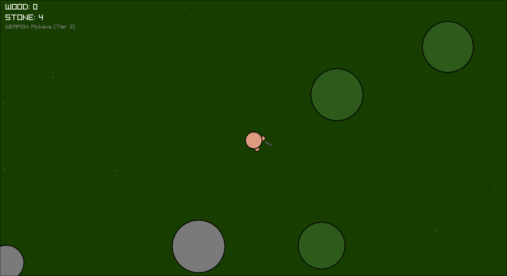
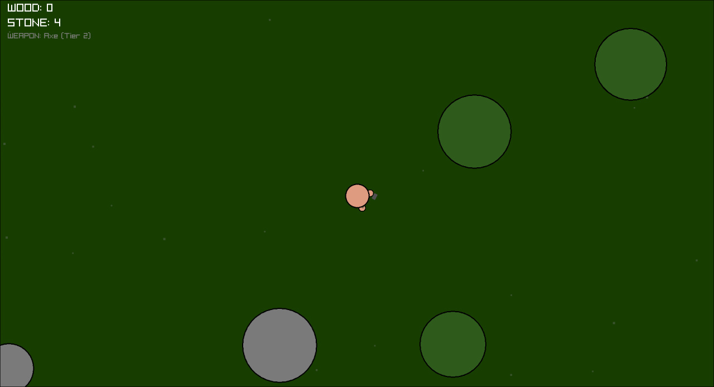

# 🌋 ASHCORE

An open-source, high-performance hardcore survival game written in pure **C++** using the **Raylib** library. Inspired by classic top-down survival mechanics, built for ultra-responsive gameplay, lag-free physics, and intense PvP.

---

## 🚀 Current Status: Alpha v0.1.0

The project is evolving rapidly from a basic prototype into a playable survival framework.

### 🎮 Implemented Features:
* **Core Mechanics:** Smooth character movement, physics, and jump mechanics.
* **Interaction System:** Basic attack animations, object hitboxes, and hand-to-object harvesting.
* **Resource Gathering:** Dynamic spawning of world objects (Trees, Rocks) with a complete destructibility/harvesting system.
* **Inventory & Progression:** Basic resource items (**Wood** and **Stone**) and a multi-tier tool upgrade system:
  * 🪓 *Wooden Axe & Stone Axe* (for faster wood chopping)
  * ⛏️ *Wooden Pickaxe & Stone Pickaxe* (for faster stone mining)

---

## 📸 Screenshots

### Gameplay Screenshots (Alpha v0.1.0)





---

## 🛠️ How to Build & Run

### Dependencies
Make sure you have a working C++ compiler, **CMake**, and the **Raylib** development packages installed on your system.

```bash
mkdir build && cd build
cmake ..
make
./ASHCORE
```

## 🔗 Connect & Follow


Stay updated on the development process, watch new devlogs, or chat directly with me:


    📱 Telegram: https://t.me/maximusD15 (Devlog & Community Chat)


    🎵 TikTok: https://www.tiktok.com/@maximusd15tiktok (Short devlogs & clips)


    📺 YouTube: https://youtube.com/@maximusD15 (Full video logs & showcase)


    💬 Discord: maximusd15


## 🕊️ Support the Development


If you want to support a young lion and speed up the creation of ASHCORE, you can drop some crypto here:


    Trust Wallet (USDT BEP20 / BNB): 0x72f78F80a68475C1aD50978e4D47dA08894a41fD
