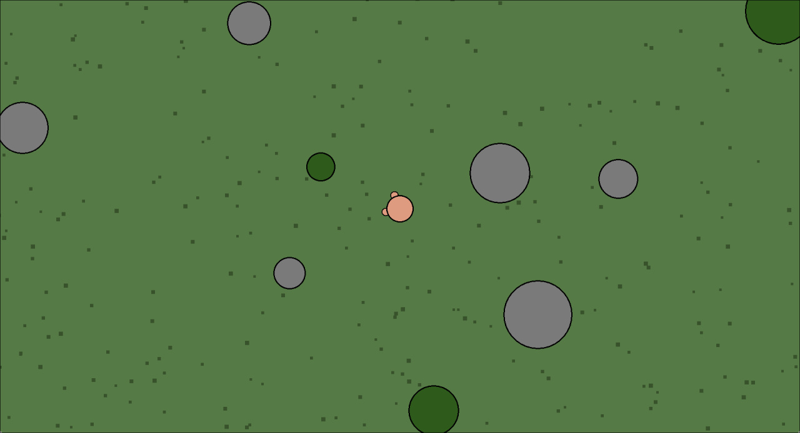

# Doomed2.io C++ Remake

A smooth, high-performance remake of the classic browser survival game Doomed.io, written in C++ ( Raylib ). The main goal is to eliminate lags, make the gameplay responsive, and add own features

## 🚀 Current Status (Prototype)
The project is in its very early stages. Currently implemented:
- [x] Character movement & smooth physics
- [x] Jump mechanic
- [x] Basic attack / interaction
- [x] Spawning of simple resources ( trees, rocks )

## 📸 Screenshot

## 🛠️ How to Build
Dependencies: C++ compiler, CMake, Raylib.

mkdir build && cd build
cmake ..
make
./DoomedRemake

☕ Support the Development

If you want to support a young lion and speed up the development, you can drop some crypto here:

Trust Wallet (USDT BEP20 / BNB):0x72f78F80a68475C1aD50978e4D47dA08894a41fD
